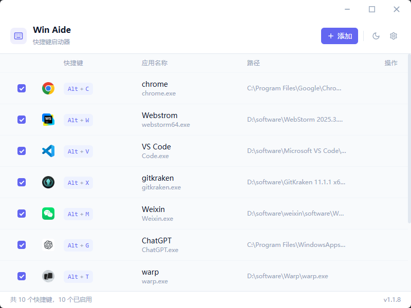

<p align="center">
  
</p>

<h1 align="center">Win Aide</h1>

<p align="center">一款轻量级的 Windows 全局快捷键启动器，使用 Rust + <a href="https://dioxuslabs.com/">Dioxus</a> 构建。</p>

<p align="center">通过自定义全局热键快速启动或激活应用程序，支持同应用多窗口循环切换，让你的 Windows 桌面操作更加高效。</p>

<p align="center">
  
</p>

## 功能特性

- **全局热键启动** — 为常用应用绑定 `Alt/Ctrl/Win + 按键` 快捷键，一键启动或激活窗口
- **窗口循环切换** — 使用 `Alt+\`` 在同一应用的多个窗口间快速切换（支持自定义按键）
- **系统托盘常驻** — 关闭窗口自动最小化到托盘，随时通过托盘菜单恢复
- **运行中进程选择** — 从当前运行的应用列表中直接选择，无需手动填写路径
- **冲突检测** — 自动检测重复的热键分配，避免快捷键冲突
- **开机自启** — 可选开机自动启动，注册到 Windows 启动项
- **深色模式** — 支持明暗主题切换
- **持久化配置** — 配置自动保存到 `~/.win_aide/config.json`

## 安装

### 下载安装包

前往 [GitHub Releases](https://github.com/Mrjen/win_aide/releases) 页面下载最新版本的安装包（`.msi`），双击运行即可安装。

### 从源码构建

**前置依赖：**

- [Rust](https://rustup.rs/)（推荐使用 `rustup` 安装）
- [Dioxus CLI](https://dioxuslabs.com/)

```bash
# 安装 Dioxus CLI
cargo install dioxus-cli

# 克隆仓库
git clone https://github.com/Mrjen/win_aide.git
cd win_aide

# 构建
cargo build -p desktop --release
```

构建产物位于 `target/release/desktop.exe`。

### 开发运行

```bash
cd packages/desktop
dx serve
```

## 使用方法

1. 启动应用后，点击 **添加** 按钮创建新的快捷键
2. 设置应用名称，选择可执行文件路径（或点击「从运行中的程序选择」）
3. 选择修饰键（Alt / Ctrl / Win）和触发按键
4. 保存后即可通过全局热键启动或激活目标应用

### 窗口循环切换

默认使用 `Alt + \`` 在当前应用的多个窗口间切换，`Alt + Shift + \`` 反向切换。可在设置面板中自定义按键或关闭此功能。

### 系统托盘

- 关闭窗口会自动隐藏到系统托盘
- 右键托盘图标可以：显示主窗口、暂停/恢复所有快捷键、退出应用

## 项目结构

```text
win_aide/
├─ Cargo.toml              # Workspace 配置
├─ packages/
│  ├─ desktop/              # 桌面应用主程序
│  │  ├─ src/
│  │  │  ├─ main.rs         # 应用入口与初始化
│  │  │  ├─ config.rs       # 配置管理（加载/保存/冲突检测）
│  │  │  ├─ hotkey.rs       # Windows 全局热键注册与监听
│  │  │  ├─ launcher.rs     # 应用启动/激活/窗口循环
│  │  │  ├─ process.rs      # 运行中进程枚举与图标提取
│  │  │  ├─ tray.rs         # 系统托盘图标与菜单
│  │  │  ├─ autostart.rs    # 开机自启注册表管理
│  │  │  └─ views/          # UI 页面组件
│  │  └─ assets/            # 静态资源
│  └─ ui/                   # 跨平台共享 UI 组件库
│     └─ src/
│        ├─ lib.rs           # 组件导出与公共类型
│        ├─ shortcut_list.rs # 快捷键列表组件
│        ├─ shortcut_form.rs # 快捷键编辑表单
│        ├─ process_picker.rs# 进程选择器
│        └─ navbar.rs        # 导航栏
```

## 技术栈

- **语言** — [Rust](https://www.rust-lang.org/)
- **UI 框架** — [Dioxus 0.7](https://dioxuslabs.com/)（基于 WebView 的桌面渲染）
- **样式** — [Tailwind CSS](https://tailwindcss.com/)
- **系统集成** — [windows-rs](https://github.com/microsoft/windows-rs)（Win32 API 调用）
- **系统托盘** — [tray-icon](https://crates.io/crates/tray-icon) + [muda](https://crates.io/crates/muda)

## 参与贡献

欢迎提交 Issue 和 Pull Request！

1. Fork 本仓库
2. 创建你的特性分支（`git checkout -b feat/amazing-feature`）
3. 提交你的修改（`git commit -m 'feat: 添加某个功能'`）
4. 推送到分支（`git push origin feat/amazing-feature`）
5. 创建一个 Pull Request

## 许可证

本项目基于 [MIT 许可证](LICENSE) 开源。
